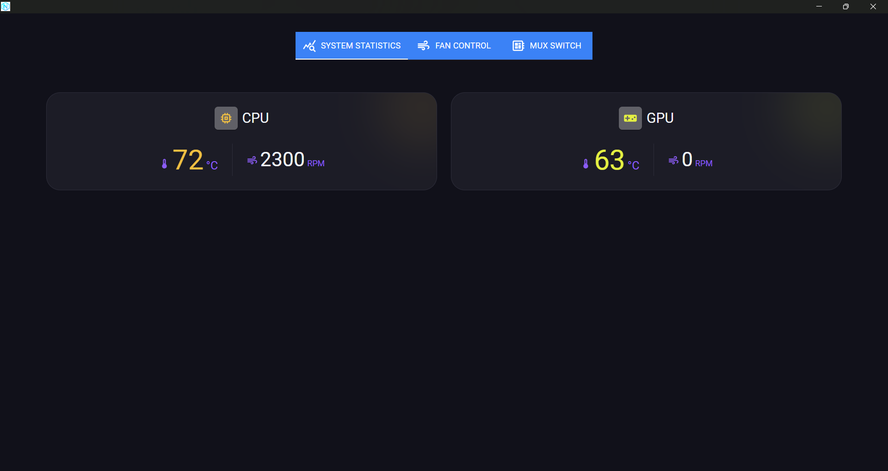
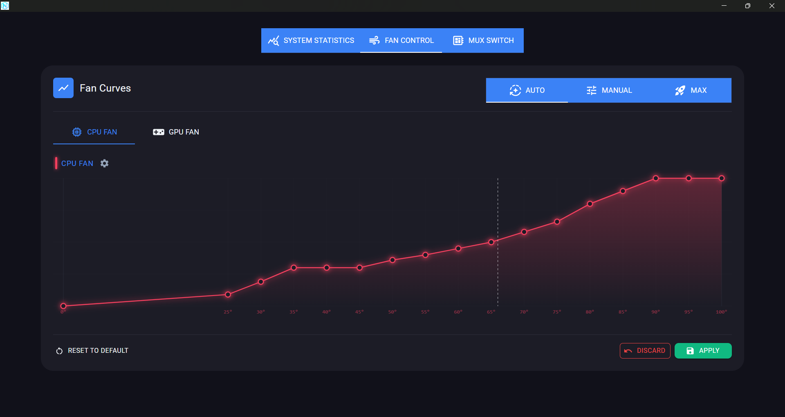
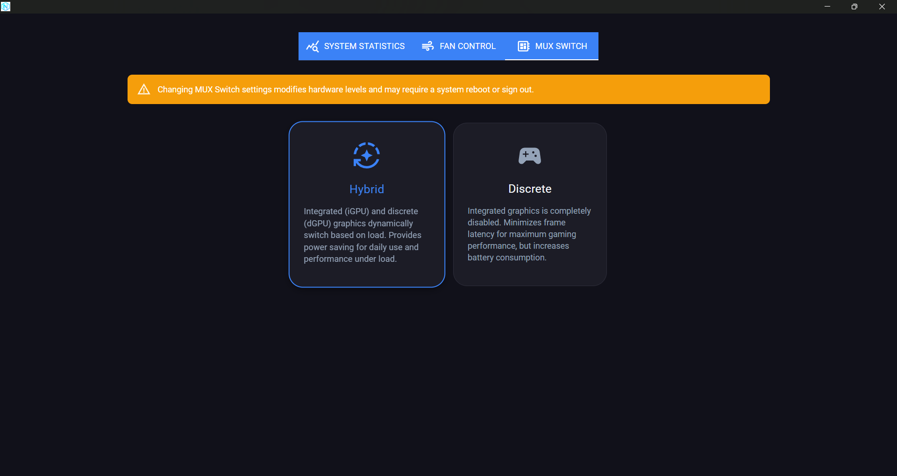

# Nexus

**Pure, clean, and bloat-free central hardware controller for HP laptops.**

You shouldn't need a bloated app eating up gigabytes of RAM, tracking your gaming habits, and shoving ads in your face just to change a fan speed or switch a MUX state. 

Nexus was built as the lightweight antidote to OEM bloatware. 

**No Ads.**  
**No Telemetry.**  
**No Spyware.**  
**No Bloatware.**  

Just a blazing-fast, strictly optimized background service paired with a featherweight UI, doing exactly what you command, nothing more, nothing less.

## Screenshots

<b>Click to expand screenshots</b>

 

**System Statistics**

**Fan Control & Curve Management**

**MUX Switch Settings**

## Features

* **Advanced Fan Control:** Create custom, temperature-based fan curves for both the CPU and GPU independently.
* **Hardware Thermal Modes:** Override OEM settings to seamlessly switch between Auto, Max, and Manual fan modes.
* **MUX Switch Management:** Control your display routing (Discrete, Hybrid, Optimus, UMA) directly from the app interface.
* **Zero-Overhead Service:** The core hardware coordinator runs as a Windows Service with `LocalSystem` privileges, compiled with Native AOT to ensure maximum stability and zero background friction.

> [!IMPORTANT]
> **Prerequisites**
>
> To accurately read real-time CPU temperatures and adjust fan speeds dynamically, Nexus relies on shared memory telemetry.
> * **Core Temp:** You **MUST** have [Core Temp](https://www.alcpu.com/CoreTemp/) installed and running in the background. If Core Temp is not detected, manual fan curves relying on CPU temperature will not function correctly.

## Important Warnings & Disclaimer

> [!WARNING]
> **READ CAREFULLY BEFORE USING**
> 
> * **Tested ONLY on HP Victus 16:** At this stage, this software has been exclusively developed and tested on the HP Victus 16 series.
> * **Other Models are UNTESTED:** While other HP series (such as Omen or different Victus iterations) may share the same underlying ACPI/WMI architecture, **they are not tested.** Necessary hardware safety checks, maximum RPM limits, and thermal boundaries for other mainboards have not been implemented yet. Using this on untested devices may cause unpredictable behavior.
> * **USE AT YOUR OWN RISK:** This software interacts directly with your system's hardware, embedded controller (EC), and ACPI tables. The developer assumes absolutely NO responsibility for any hardware damage, overheating, data loss, or system instability. You accept all risks and consequences by running this software.

## Architecture

The project consists of two tightly integrated components:
1. **Nexus.Service:** A strictly optimized Windows Background Service (.NET 10) that interacts with HP WMI/ACPI interfaces to manipulate hardware states. It runs silently and hosts a JsonRpc server.
2. **Nexus.Client:** The frontend UI that connects to the background service via IPC (Named Pipes) to send configurations, update fan curves, and read live telemetry data seamlessly.

> [!NOTE]
> **Contributions are welcome!**
> 
> Whether you want to report a bug, suggest a new feature, or submit a pull request, your input is highly appreciated. Feel free to check the [issues page](https://github.com/kursatabayli/Nexus/issues) to see where you can help or to discuss any major changes before submitting a PR.

## License

This project is licensed under the GNU General Public License v3.0 (GPL-3.0) - see the [LICENSE](https://github.com/kursatabayli/Nexus?tab=GPL-3.0-1-ov-file) file for details.
